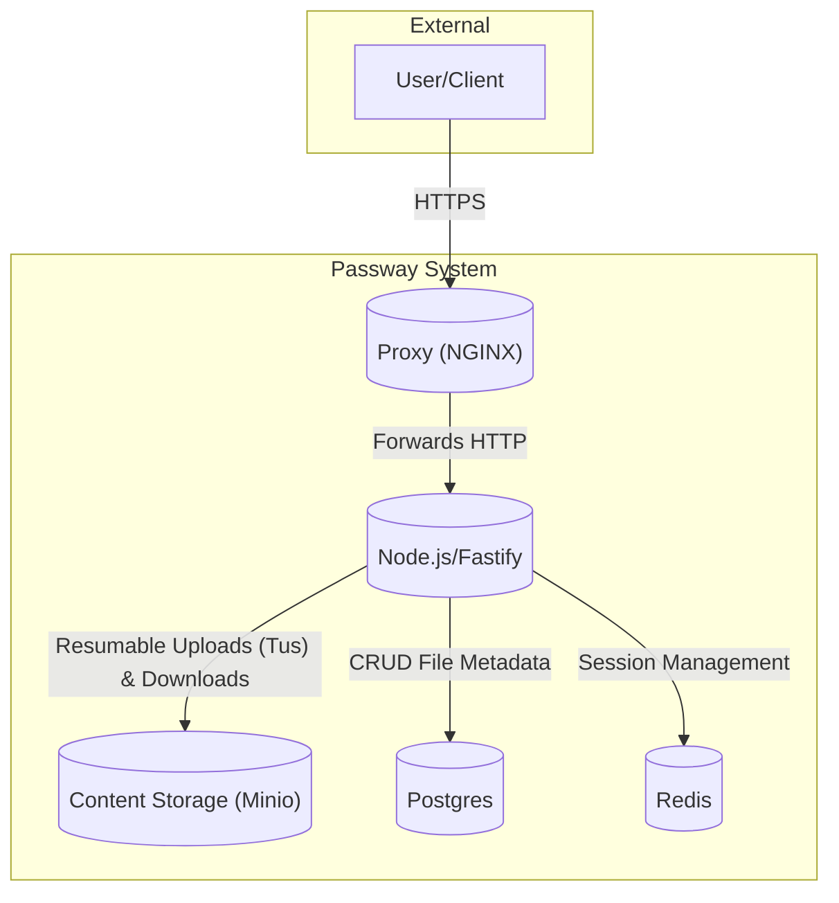

# Passway Server Architecture

This document provides a comprehensive overview of the Passway server architecture, focusing on the technologies, patterns, and coding style employed.

## 1. High-Level Overview

The Passway server is designed as a multi-component system, containerized for portability and ease of deployment. The primary components are:

- **Proxy (`server/proxy`):** An NGINX server that acts as a reverse proxy, forwarding all incoming HTTP requests to the API service. This is a standard pattern for abstracting the application server from the public interface and can be extended for load balancing and SSL termination.
- **API (`server/api`):** The core of the backend. It's a Node.js application written in TypeScript that handles all business logic, user management, authentication, and file metadata management.
- **Content Storage (`server/content-storage`):** A Minio object storage server, which provides an S3-compatible API for storing files. This service is responsible for the persistent storage of user-uploaded content.

### 1.1. System Diagram

The following diagram illustrates the flow of requests and data between the different components of the Passway server.

## 2. API Component (`@passway/api`)

The API is a modern, robust, and type-safe Node.js application built with a focus on maintainability and developer experience.

### 2.1. Core Technologies

- **Runtime:** Node.js
- **Language:** TypeScript
- **Web Framework:** [Fastify](https://www.fastify.io/). Chosen for its high performance, low overhead, and powerful plugin architecture.
- **Database ORM:** [Prisma](https://www.prisma.io/). Used for database access, schema management, and type-safe queries. The schema is defined declaratively in `prisma/schema.prisma`.
- **In-Memory Store:** [Redis](https://redis.io/). Used for session management via `connect-redis` and `@fastify/session`.
- **API Specification:** [OpenAPI (Swagger)](https://swagger.io/). API documentation is automatically generated from route schemas using `@fastify/swagger` and served with a themed UI via `@fastify/swagger-ui`.
- **File Uploads:** [Tus](https://tus.io/). The server implements the Tus resumable upload protocol using the `@tus/server` library, with a `@tus/s3-store` backend to stream uploads directly to the Minio content storage.

### 2.2. Architectural Patterns

The API component follows several modern architectural patterns to ensure the codebase is modular, scalable, and easy to understand.

- **Plugin-based Architecture:** The application is assembled using Fastify's plugin system. Core functionalities like database connection (`prismaPlugin`), CORS, cookies, and session management are encapsulated in plugins. This is visible in `src/app.ts`, where the main Fastify instance is built.
- **Modular, Domain-Driven Routes:** API routes are organized by domain (e.g., `user`, `session`, `content`) within the `src/routes/v1` directory. Each domain is a self-contained Fastify plugin that defines its own routes, schemas, and handlers. This makes it easy to find and modify related endpoints.
- **Service Layer Abstraction:** For complex operations that are not simple database CRUD, a service layer is used. The `UploadService` (`src/services/Upload/index.ts`) is a prime example. It encapsulates all the logic related to handling Tus uploads, interacting with Minio, and managing file metadata in the database, keeping the route handlers clean and focused.
- **Schema-Driven Development & Validation:** The API uses [TypeBox](https://github.com/sinclairzx81/typebox) via `@fastify/type-provider-typebox` to define schemas for requests (headers, body, querystring) and responses. These schemas provide three key benefits:
  1.  **Runtime Validation:** Fastify automatically validates incoming requests against the schema.
  2.  **TypeScript Safety:** The schemas are used to infer TypeScript types, providing end-to-end type safety from the request to the handler.
  3.  **Automatic Documentation:** The schemas are used to generate the OpenAPI specification.
- **Dependency Decoration:** Fastify's `decorate` API is used to inject dependencies like the Prisma client and Minio client into the application instance, making them available in any route handler or service via `app.prisma` or `app.minioClient`.

### 2.3. Coding Style & Conventions

- **Strict TypeScript:** The `tsconfig.json` is configured with strong type-checking rules across the entire codebase. This minimizes runtime errors and improves code quality.
- **Async/Await:** The codebase consistently uses `async`/`await` for handling asynchronous operations which leads to cleaner and more readable code.
- **ES Modules:** While the compiled output is CommonJS for Node.js compatibility, the source code is written using ES Module syntax (`import`/`export`).
- **Clear Structure:** The project follows a clear and logical directory structure, separating routes, services, constants, and other concerns into their own files and directories.

## 3. Code Quality and Maintenance

Code quality is enforced through a combination of language features and automated tooling.

- **Static Type Checking:** The primary tool for maintaining code quality is the TypeScript compiler. The `npm run check:types` script (`tsc --noEmit`) is used to perform a full type-check of the project.
- **Automated Testing:** The project uses [Vitest](https://vitest.dev/) for automated testing.
  - Unit and integration tests are co-located with the code they are testing (e.g., `src/routes/v1/user/index.test.ts`).
  - A dedicated test script `npm test` runs the test suite.
  - Integration tests (`npm run test:integration`) are configured separately to run against a local ephemeral environment, ensuring that different components work together as expected.
- **Linter:** The project uses ESLint to ensure a consistent code style across the codebase that adheres to best practices.
